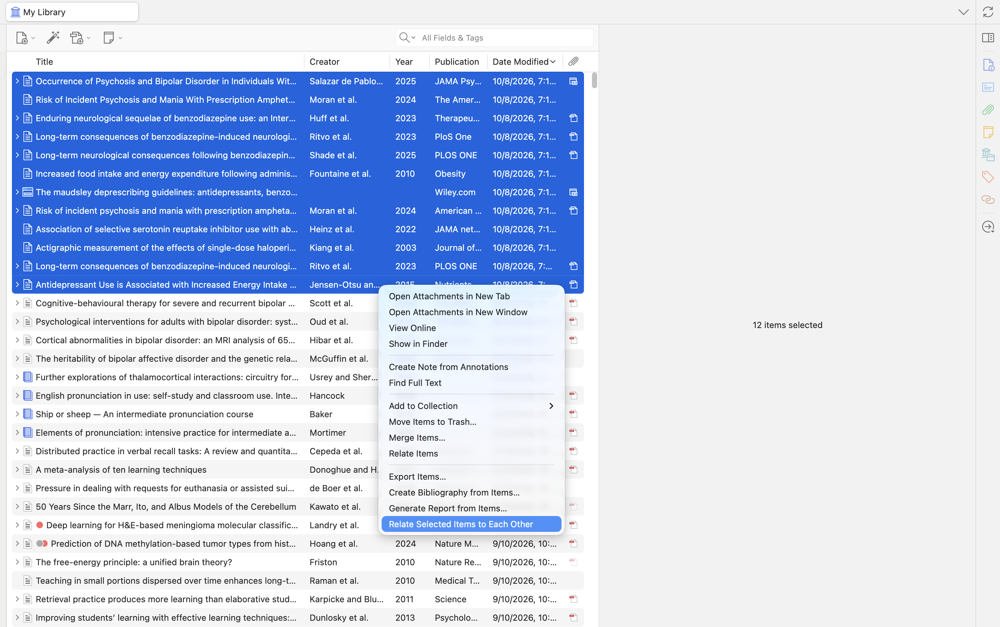

# Zotero: Relate Selected Items

[](https://github.com/<ユーザー名>/zotero-relate-selected-items/releases)
[](https://www.zotero.org/)
[](LICENSE)

A lightweight Zotero plugin that cross-relates all selected items to each other in one click.

---

## 📸 Overview


 
 


---

## 💡 The Problem & The Solution

- **The Problem**: In native Zotero, relations are mutual between two items, but they are not transitive. If you want to link 5 related papers together, you have to manually open the "Related" tab and pick links **10 different times**.
- **The Solution**: This plugin introduces an all-to-all cross-relation command. Select any number of items, right-click, and let the plugin link them all together instantly ($N \times (N-1)$ clique).

---

## ✨ Features

- **Batch Clique Linking**: Cross-links all highlighted items so every item in the selection points to every other selected item.
- **Context-Aware Menu**: The "Relate Selected Items to Each Other" option dynamically appears in the context menu only when 2 or more regular items are selected.
- **Safe & Fast Database Operations**: Built on native transactional database calls (`executeTransaction`) ensuring data integrity.
- **Smart Filtering**: Automatically filters out attachments and standalone notes to prevent erroneous relations.

---

## 📦 Installation

1. Go to the [**Latest Release**](https://github.com/<ユーザー名>/zotero-relate-selected-items/releases/latest) page.
2. Download the `.xpi` file (e.g., `zotero-relate-selected-items-0.1.0.xpi`).
3. In Zotero, navigate to **Tools** → **Add-ons** (or **Plugins**).
4. Click the gear icon (⚙️) in the top-right corner and select **"Install Add-on From File..."**.
5. Select the downloaded `.xpi` file and restart Zotero if prompted.

---

## 🚀 How to Use

1. Hold `Ctrl` (or `Cmd` on macOS) / `Shift` and select **two or more items** in your Zotero library.
2. **Right-click** on the selected items.
3. Click **"Relate Selected Items to Each Other"**.
4. Check the **Related** tab on any of the selected items to see all links established.

---

## 🛠️ Development

Built using [zotero-plugin-template](https://github.com/windingwind/zotero-plugin-template).

```bash
# Clone the repository
git clone [https://github.com/](https://github.com/)<ユーザー名>/zotero-relate-selected-items.git
cd zotero-relate-selected-items

# Install dependencies
npm install

# Build the .xpi package
npm run build