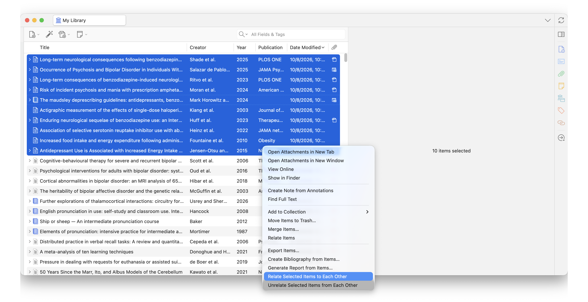
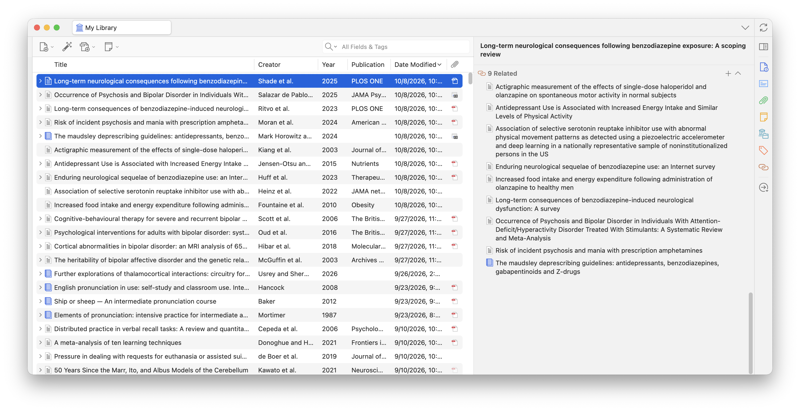
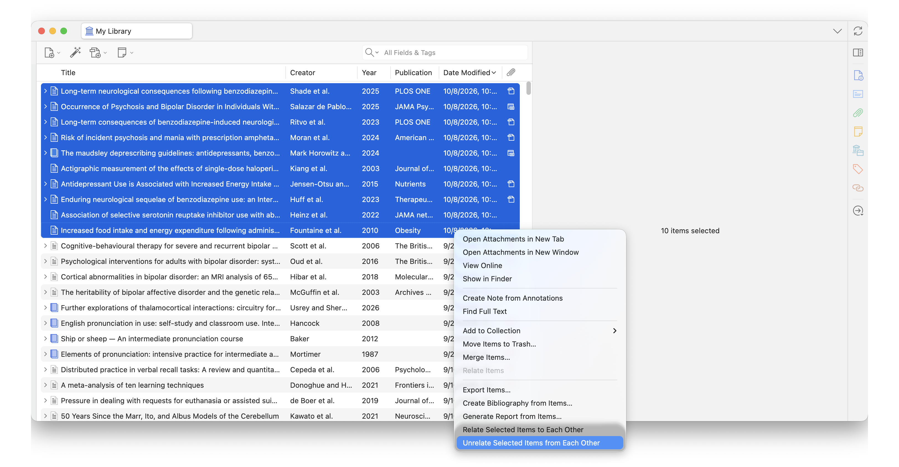

# Zotero has officially supported these features.

- Right-click command "Relate Items" was implemented in version 8.
- The "Unrelate" feature will be covered in an upcoming version.

# Zotero: Relate Selected Items

[](https://github.com/<ユーザー名>/zotero-relate-selected-items/releases)
[](https://www.zotero.org/)
[](LICENSE)

A lightweight Zotero plugin that allows you to cross-relate or unrelate all selected items in one click.

---

## 📸 Overview

<p align="center">
  
</p>
<p align="center">
  
</p>
<p align="center">
  
</p>

---

## 💡 The Problem & The Solution

- **The Problem**: In native Zotero, relations are mutual between two items, but they are not transitive. If you want to link 5 related papers together, you have to manually open the "Related" tab and select references **10 different times**.
- **The Solution**: This plugin provides batch all-to-all cross-relation commands. Select any number of items, right-click, and instantly establish or remove relations among them in a single operation ($N \times (N-1)$ clique).

---

## ✨ Features

- **Batch Clique Linking**: Cross-relate all highlighted items so every item in the selection points to every other selected item.
- **Batch Unlinking (Unrelate)**: Remove relations exclusively between the selected items without affecting links to other unselected references.
- **Context-Aware Menu**: Menu items dynamically appear only when 2 or more regular items are selected.
- **Safe & Fast Database Operations**: Built on native Zotero database transactions, eliminating lock contention and ensuring immediate, persistent synchronization.
- **Smart Filtering**: Automatically ignores attachments and standalone notes to keep relations clean.

---

## 📦 Installation

1. Go to the [**Latest Release**](https://github.com/<ユーザー名>/zotero-relate-selected-items/releases/latest) page.
2. Download the `.xpi` file (e.g., `zotero-relate-selected-items-1.0.3.xpi`).
3. In Zotero, navigate to **Tools** → **Plugins** (or **Add-ons**).
4. Click the gear icon (⚙️) in the top-right corner and select **"Install Add-on From File..."**.
5. Select the downloaded `.xpi` file and restart Zotero if prompted.

---

## 🚀 How to Use

### Relate Items:
1. Hold `Ctrl` (or `Cmd` on macOS) / `Shift` and select **two or more regular items** in your Zotero library.
2. **Right-click** on the selected items.
3. Click **"Relate Selected Items to Each Other"**.
4. Check the **Related** tab on any of the selected items to see all mutual links established.

### Unrelate Items:
1. Select **two or more items** that currently share relations.
2. **Right-click** on the selection.
3. Click **"Unrelate Selected Items from Each Other"**.
4. Relations between the selected items will be removed, while all other links to external references remain intact.

---

## 🛠️ Development

Built using [zotero-plugin-template](https://github.com/windingwind/zotero-plugin-template).

```bash
# Clone the repository
git clone [https://github.com/kouichi-c-nakamura/zotero-relate-selected-items.git](https://github.com/kouichi-c-nakamura/zotero-relate-selected-items.git)
cd zotero-relate-selected-items

# Install dependencies
npm install

# Build the .xpi package
npm run build

```

---

## 📄 License

This project is licensed under the GNU Affero General Public License v3.0 (AGPL-3.0).


